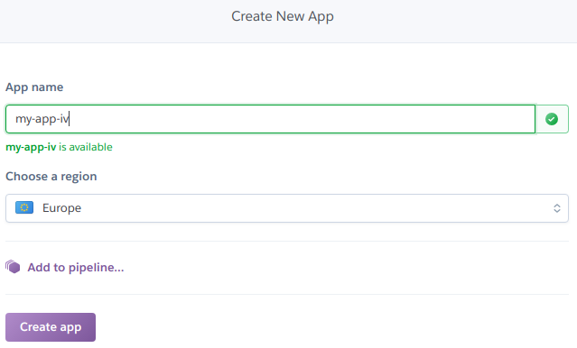
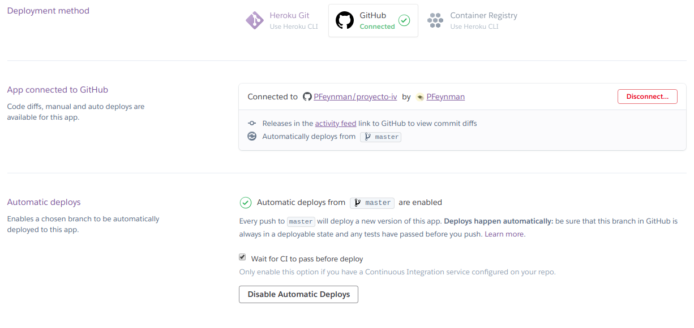

## Despliegue de la aplicación en Heroku

1. Registrarse en [Heroku](https://www.heroku.com/)
2. Instalar Heroku CLI: `$ sudo snap install heroku --classic`
3. Identificarnos con nuestras credenciales de registro: `$ heroku login`
4. Creamos el archivo Procfile en nuestro proyecto, que contiene el comando que se debe ejecutar para iniciar la aplicación. En mi caso: `web: npm start`
5. Podemos crear nuestra aplicación desde la CLI de Heroku o desde la web. Debemos indicar que se utilice un servidor de Europa y podemos cambiar el nombre de la aplicación para que no nos asigne uno por defecto.

6. Desde nuestro "Dashboard", accedemos a nuestra app y vamos a la pestaña de "Deploy". En "Deploy method" seleccionamos Github y vinculamos nuestra cuenta y repositorio con la app. Habilitamos el despliegue automático e indicamos que se espere a pasar los tests de Integración Continua.

7. Podemos hacer push a nuestro repositorio remoto y cuando se pasen los tests, se debería desplegar la aplicación.
8. Para ver el log de la aplicación ejecutamos `$ heroku logs --tail`. De esta manera podemos ver los problemas que ocurran en el despliegue y buscar la solución :arrow_right: introducimos la solución, hacemos push de nuevo, comprobamos si ahora ha funcionado el despliegue. 
