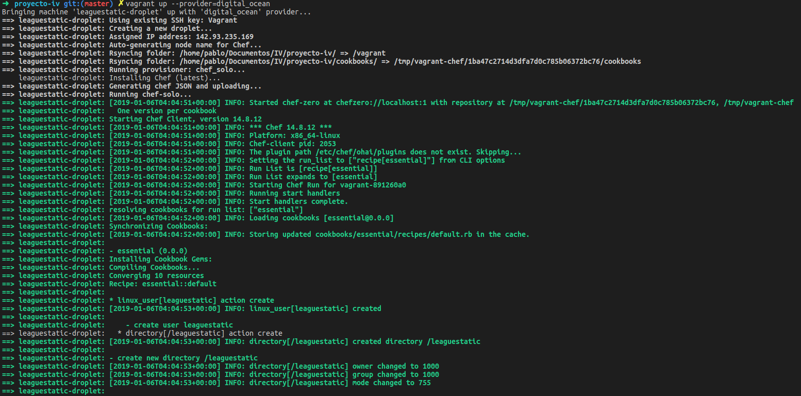
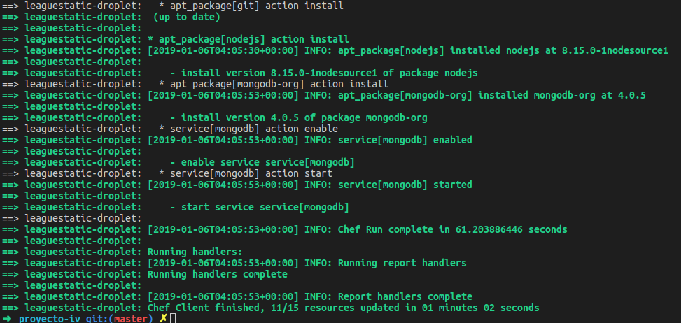
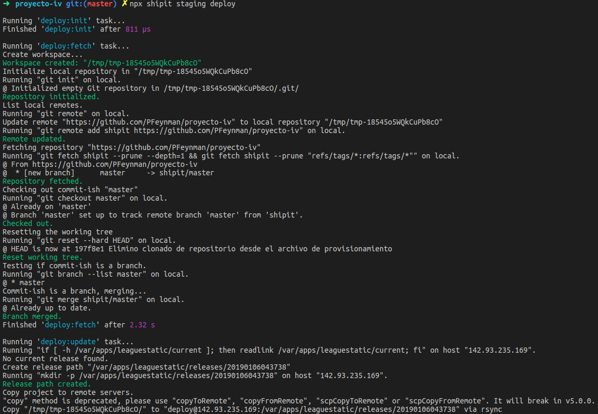
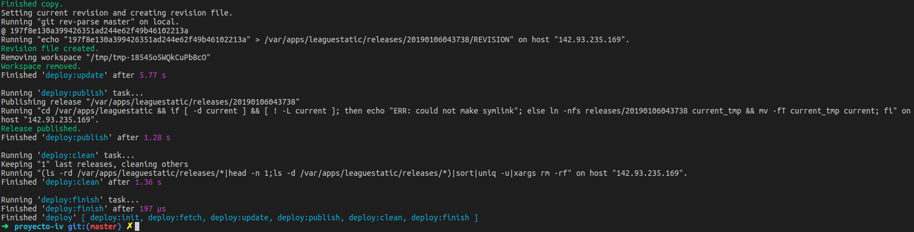

### Despliegue de la aplicación en DigitalOcean

Para el despliegue de la aplicación se han realizado tres pasos:
    - Creación de una máquina virtual en un IAAS (mediante Vagrant)
    - Provisionar la máquina creada (usando Chef)
    - Desplegar la aplicación clonando el repositorio utilizando una herramienta de despliegue automático (Shipit)

## Creación de la máquina virtual - Vagrantfile

Antes de nada, se debe obtener el token de acceso que nos proporciona DigitalOcean y guardarlo en una variable de entorno. 
También se necesita descargar el plugin de Vagrant de DigitalOcean: `$ vagrant plugin install vagrant-digitalocean`
Podemos ejecutar `$vagrant init` que nos creará un fichero Vagrantfile por defecto. 

En el fichero Vagrantfile, indicamos que nuestro proveedor es DigitalOcean: `config.vm.provider :digital_ocean`. Y configuramos las variables que el proveedor necesita: el directorio que almacena nuestra clave SSH, la box de DigitalOcean, nuestro token de acceso, el sistema operativo que queremos en nuestra máquina (Ubuntu 18) y la región en la que estará nuestra máquina (por ley debe de estar en Europa, por lo que he elegido Ámsterdam). 

Finalmente indicamos qué herramienta de provisionamiento usaremos (Chef, chef-solo). Chef-solo utiliza un directorio con una estructura determinada que se puede consultar [aquí](https://www.vagrantup.com/docs/provisioning/chef_solo.html). 

## Provisionamiento de la máquina virtual - Chef

Mi aplicación necesita que en la máquina estén instalados Node (y npm) y una base de datos de Mongo, además de Git como es habitual. 
Para instalar mongo se necesita añadir al repositorio mediante una key y crear un fichero .list, por lo que utilizo la función *execute* de Chef para ejecutar los comandos que lo hagan. 
Mi aplicación está escrita en Node 8.15, por lo que también debemos indicar el repositorio. 

Una vez hemos indicado los repositorios, con la directiva *package* instalamos todos los paquetes que necesitamos.

Con la directiva service podemos lanzar el servicio de mongo (`action :start`) e indicar que arranque cuando se arranque la máquina (`action :enable`). La propiedad supports le indica al cliente de chef qué acciones hacer con el servicio, para que sepa cómo ejecutarlas cuando lo necesite. 

Para crear y provisionar la máquina se ejecuta: `vagrant up --provider=digital_ocean`

Aunque no lo he utilizado, he creado un usuario *leaguestatic* y su directorio home. Realmente ha sido un error no haberlo utilizado, ya que al usar el directorio */var/apps/leaguestatic*, el usuario *deploy* necesitaba pertenecer al grupo *root*. Si hubiera utilizado el usuario leaguestatic y su home, no habría tenido ese problema. 

## Despliegue automático - Shipit

Shipit es una herramienta para despliegues automáticos escrita en Javascript y que puede instalarse fácilmente con npm. 

Necesita de un archivo *shipitfile.js* en el que se definen las variables necesarias para el despliegue (directorio de la máquina remota donde se va a deplegar, path a la key ssh y URL del repositorio) y las tareas que necesitemos realizar respecto a la aplicación.
En el objeto *staging* se indica el usuario, el URL o IP del servidor y el puerto SSH si no es el 22.
Puede añadirse un objeto *production* para indicar los servidores de producción. 

Por último, creamos las tareas con la función `task`. 
He añadido cuatro tareas:
    - *initDB* para añadir los datos a la base de datos.
    - *install* para instalar los paquetes de Node necesarios.
    - *start* para lanzar la aplicación.
    - *stop* para detenerla.

Para desplegar la aplicación se ejecuta: `npx shipit --shipitfile despliegue/shipitfile.js staging deploy`
Para ejecutar cualquiera de las tareas se ejecuta: `npx shipit --shipitfile despliegue/shipitfile.js staging tarea`
Si se tienen servidores de producción se cambia staging por *production*.

# Referencias

[Vagrant & DigitalOcean](https://www.digitalocean.com/community/tutorials/how-to-use-digitalocean-as-your-provider-in-vagrant-on-an-ubuntu-12-10-vps)
[Chef](https://docs.chef.io/resource.html)
[Vagrant Provisioning](https://www.vagrantup.com/docs/provisioning/chef_solo.html)
[Shipit](https://github.com/shipitjs/shipit)